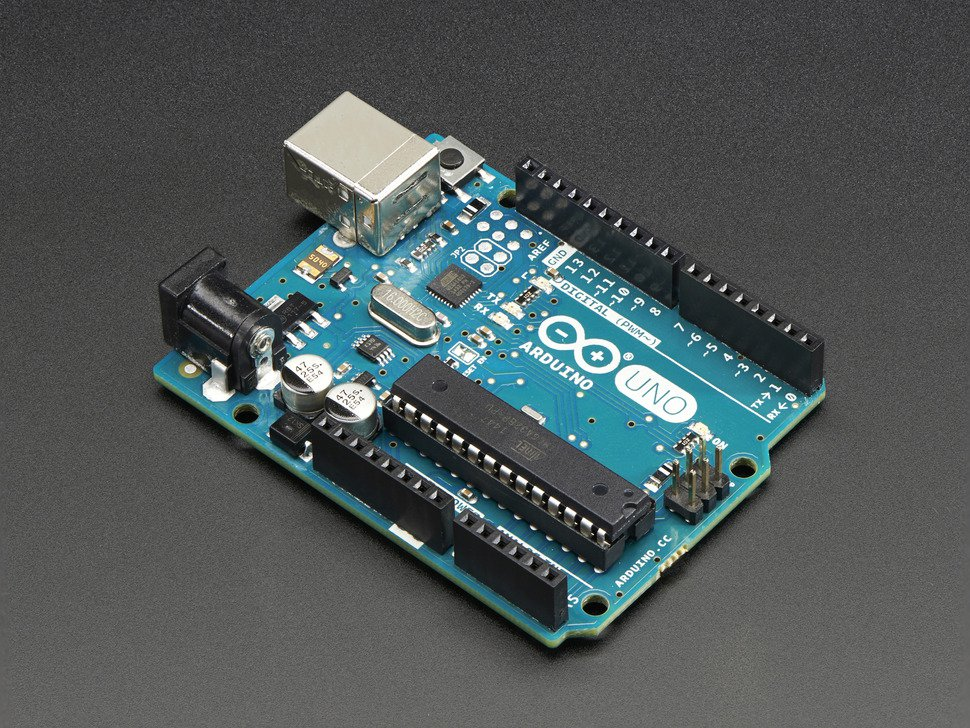
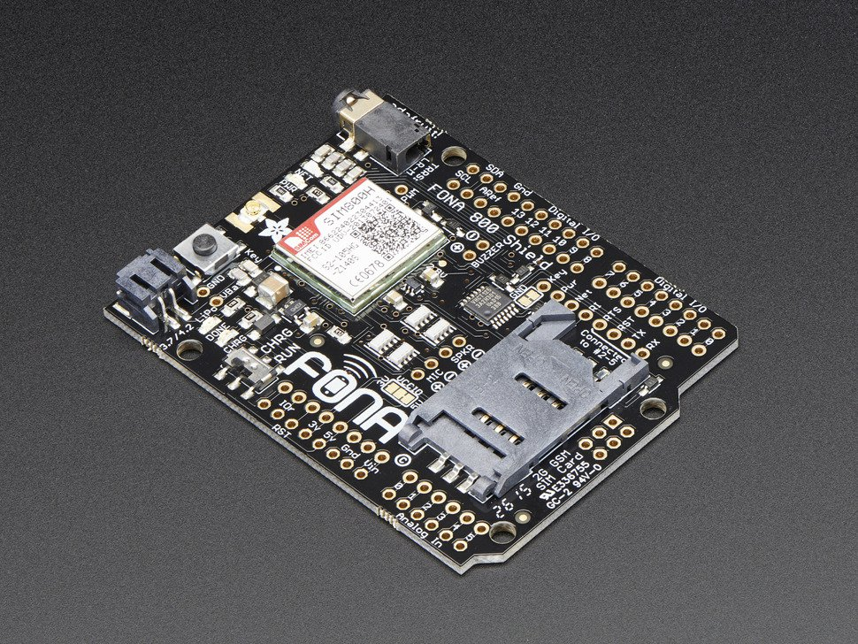
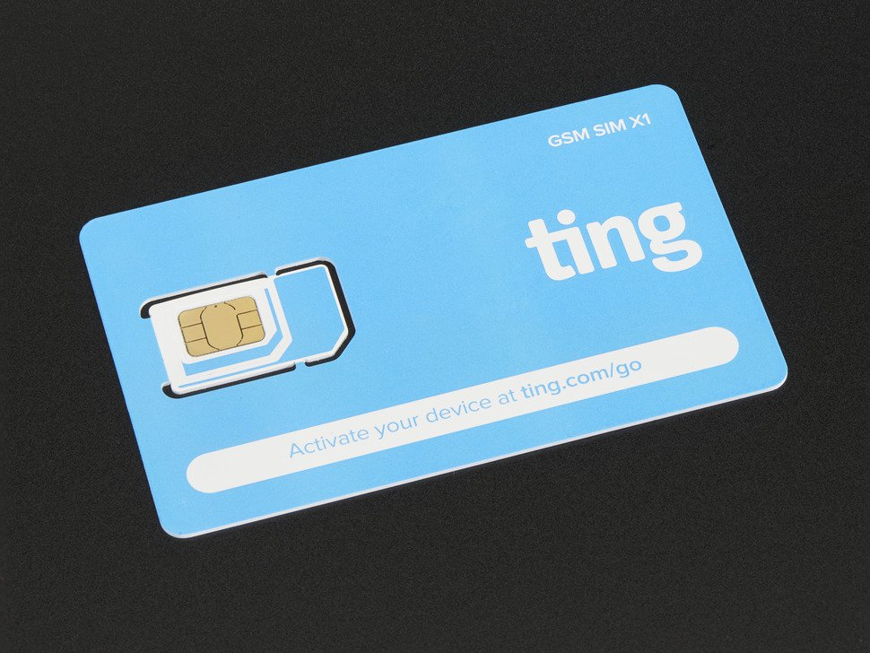
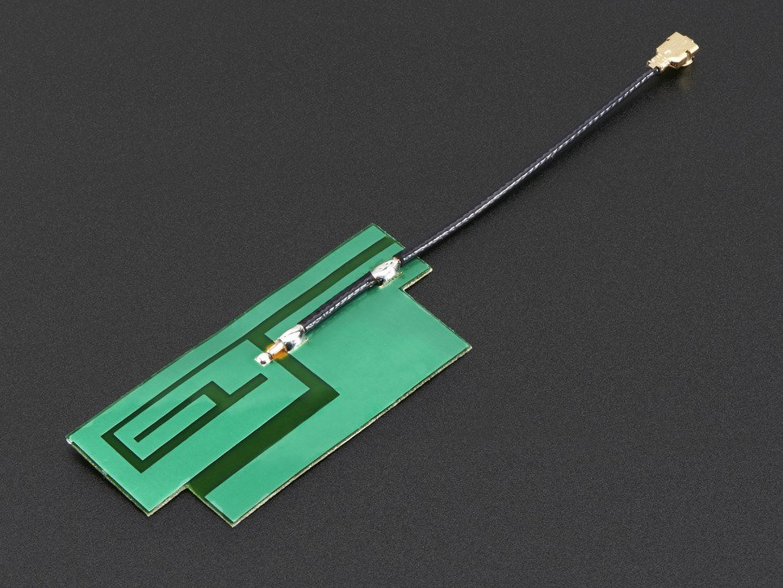
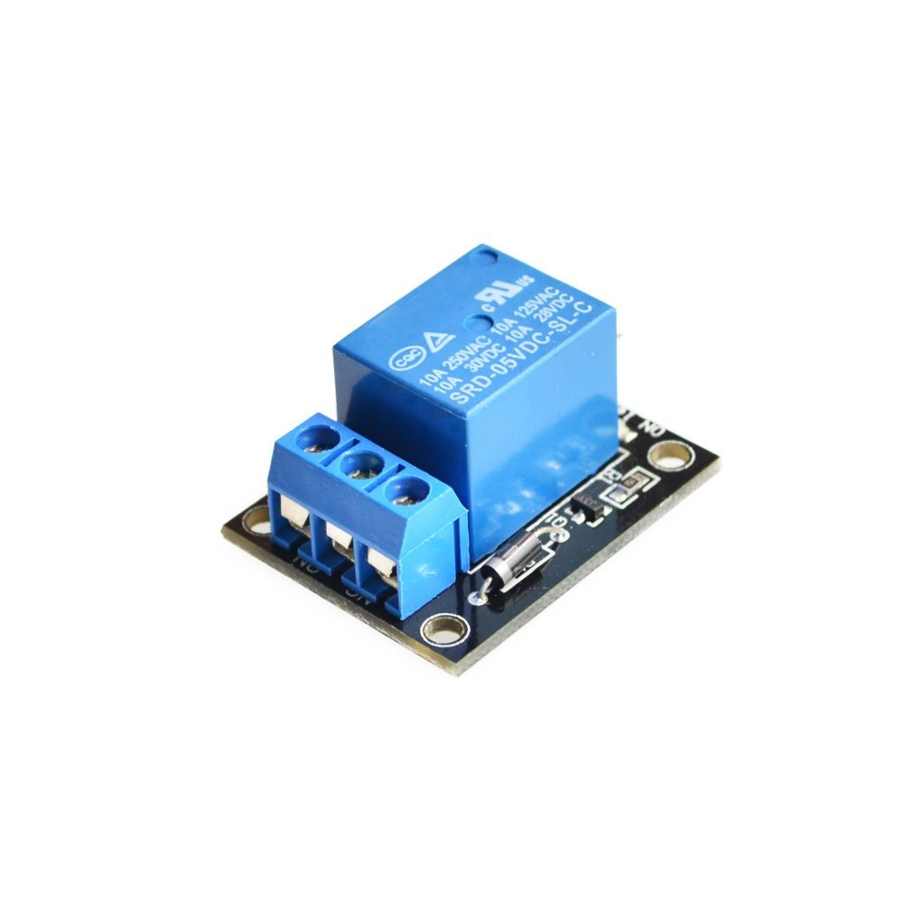
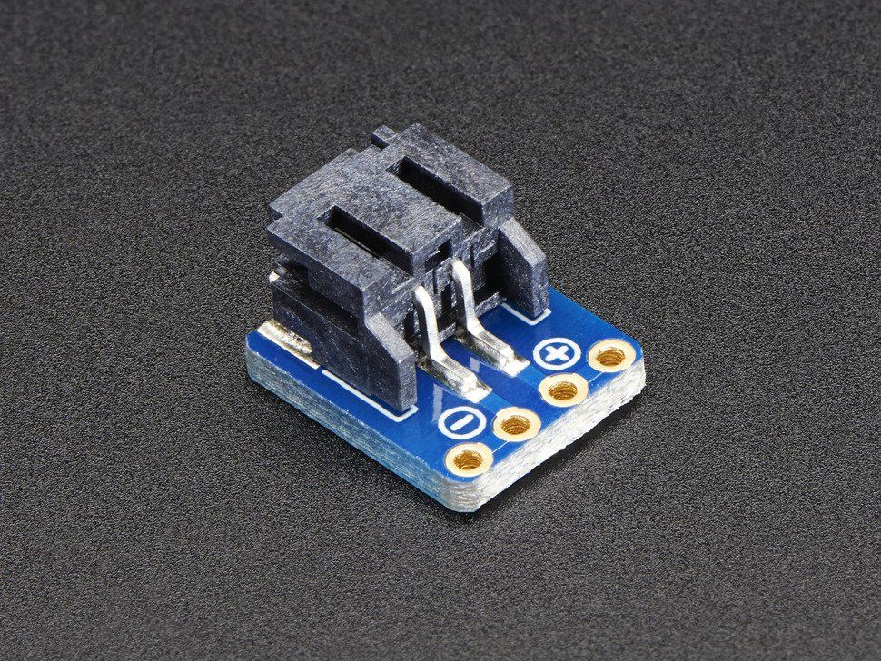
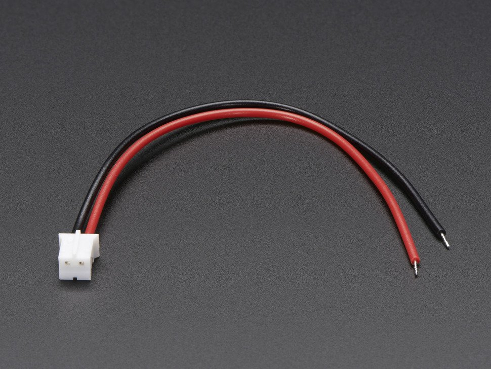

# SMS Door Control
This project allows you to build a SMS controlled door buzzer with minimal impact to existing infrastructure.

**This is an active project that will change as often as required**

## Premises
I rent an old apartment in SF. There is no door man so deliveries are difficult.

To circumvent this, I created this project which allow the delivery company to gain temporary access to the lobby using a text message.

At the same time, I get notified and have remote control to the system through the text interface.

Finally, because I rent, I wanted a none intrusive and damaging system.

## Bill of Materials

|Picture|Label|Comments|
|---|----|----|
|  | [Arduino Uno R3 (Atmega328 - assembled)](https://www.adafruit.com/product/50) | The brain of the project|
|  | [Adafruit FONA 800 Shield - Voice/Data Cellular GSM for Arduino](https://www.adafruit.com/product/2468) | Making your life easy to access by SMS|
|  | [GSM 2G SIM Card from Ting & Adafruit - Data/Voice/Text USA Only](https://www.adafruit.com/product/2505) | Cheap plan, you can use others too |
|  | [Lithium Ion Polymer Battery - 3.7v 1200mAh](https://www.adafruit.com/product/258) | Mandatory for the GSM module |
|  | [Slim Sticker-type GSM/Cellular Quad-Band Antenna - 3dBi uFL](https://www.adafruit.com/product/1991) | |
|  | [Relay module](https://www.amazon.com/Tolako-Arduino-Indicator-Channel-Official/dp/B00VRUAHLE/ref=pd_sim_107_33?_encoding=UTF8&pd_rd_i=B00VRUAHLE&pd_rd_r=VF8SZMM6R1D1YN7Z43DF&pd_rd_w=X3afK&pd_rd_wg=gjJNH&psc=1&refRID=VF8SZMM6R1D1YN7Z43DF) | This works with pretty much every voltages |
|  | [JST-PH 2-Pin SMT Right Angle Breakout Board](https://www.adafruit.com/product/1862) | |
|  | [JST 2-pin cable](https://www.adafruit.com/product/261) | I used this cable to easily dismount the Control from the door bell button. The cable get screwed to the door buzzer button inside the apartment |

## Tools Needed
You can obviously use other tools, but these are the one I used to make this project a reality.

Soldering Iron - https://www.amazon.com/AMERICAN-HAKKO-PRODUCTS-INC-FX-951/dp/B0012B8NW8/ref=sr_1_1?ie=UTF8&qid=1499580268&sr=8-1&keywords=fx-951

Solder - https://www.amazon.com/Kester-24-6337-0027-Solder-Alloy-Diameter/dp/B0149K4JTY/ref=sr_1_11?s=hi&ie=UTF8&qid=1499580294&sr=1-11&keywords=solder

3D Printer - http://shop.prusa3d.com/en/3d-printers/59-original-prusa-i3-mk2-kit.html

Hot Glue Gun - https://www.amazon.com/Surebonder-PRO2-100-100-Watt-Temperature-Industrial/dp/B006IY359K/ref=sr_1_34?s=arts-crafts&ie=UTF8&qid=1501343293&sr=1-34&keywords=hot+glue+gun

Screws - I salvaged screws from old electronics

## Assembly
1. Print the case & lid
2. Tap the mounting hole for the boards
3. Place the battery and zip tie it
4. Screw in the relay module
5. Hot glue the JST connector into its location
6. Place the Arduino and screw it in place
7. install the sim card on the Fona and the Fona on the Arduino
7. Connect a JST cable to your door bell button
8. Place the case close and connect the JST connector.

Note: I use picture frame mounting "velcro" straps to mount the case and to be able to dismount it easily for charging and changes to the code.

## Software

I started this project using one of the sample provided by Adafruit.

What followed is a modified version to deliver the feature I wanted.

All you need to do is change the host phone number, guest code, upload the .ino into the arduino and you are good to go.

## Usage
There is two sets of access type: Guest and Host. Host is the owner of the device while guest is anyone trying to access the door with the access code.

### Guest
Guest only need to send a text with the access code you set at the begining of the file or modified using the host commands.

### Host
Host command are bound to the register phone number. It's not exactly über safe, but decent enough for the purpose.

Here are the list of the commands to be sent by text message.

`OVERRIDE`: Opens the door the exact same way the access code door for the guests.

`FLUSHSMS` : deletes all SMS.

## Questions
You can reach me on social media or in the issues here.
Checkout tinkerlocker.com.
